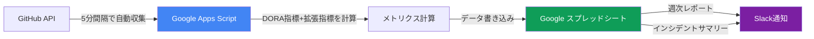

# DevSyncGAS

**AIと一緒に開発するチームのための、開発生産性ダッシュボード**

GitHub × Google スプレッドシート × Slackで、コードを書いてからリリースまでの全てを可視化・共有します。

---

## 📖 初めての方へ

このREADMEは約10分で読めます。目的に応じて以下から選んでください：

| 目的 | 所要時間 | 次のステップ |
|------|---------|------------|
| **🚀 とにかく動かしたい** | 15分 | [クイックスタート](docs/QUICK_START.md) → GASエディタで `initConfig()` 実行 |
| **📊 どんな指標が見れるか知りたい** | 5分 | [DORA指標](docs/DORA_METRICS.md) + [拡張指標](docs/EXTENDED_METRICS.md) |
| **🏗️ アーキテクチャを理解したい** | 20分 | [アーキテクチャ](docs/ARCHITECTURE.md) |
| **💻 開発に参加したい** | 30分 | [開発ガイド](CLAUDE.md) → [学習パス](#-学習パス) |

**このREADMEで分かること:**
- なぜDORA指標なのか（スプリントベロシティとの違い）
- DevSyncGASの特徴（ゼロコスト、セキュア、10分でセットアップ）
- 基本的なセットアップ手順

---

## 📚 主要な用語

| 用語 | 説明 |
|------|------|
| **DORA指標** | Google Cloudの研究チームが確立した、開発生産性を測る4つの指標（デプロイ頻度、リードタイム、変更障害率、MTTR） |
| **GAS** | Google Apps Script - Googleスプレッドシートを自動操作できるJavaScript実行環境 |
| **clasp** | コマンドラインからGASプロジェクトを管理するツール（Google公式） |
| **リードタイム** | PR作成からデプロイまでの時間（DORAの定義では「コミットから本番まで」だが、PRベースで計測） |
| **サイクルタイム** | Issue作成からマージまでの時間（拡張指標） |

詳細な用語は各ドキュメントで説明しています。

---

## 💡 こんな悩み、ありませんか？

- 💭 「AI使ってるけど、チーム全体で本当に速くなってる?」
- ⏰ 「レビュー待ちが長い気がするけど、数字で証明できない」
- 🚀 「デプロイ頻度を上げたいけど、現状が把握できていない」
- 🔒 「新しいツールを導入したいが、セキュリティ承認が面倒」

**DevSyncGASは、これらの問いに数字で答えます。**

```
Before: 感覚で判断 → 「多分速くなってる...はず？」
After:  データで判断 → 「リードタイム 48h → 18h（62%改善）」
```

## なぜDORA指標なのか？

### スプリントベロシティの限界

```
従来: ストーリーポイント消化 = チーム速度
AI時代: コード生成は速い、でも検証の複雑さは変わらない
    ↓
ベロシティは上がるが、本番リリースは変わらない
```

Scrum.orgも[「ベロシティは虚栄の指標になりつつある」](https://www.scrum.org/resources/blog/velocity-agent-efficiency-evidence-based-management-ai-era)と警鐘を鳴らしています。

### 本当に測るべきは「価値提供の速さ」

DORA指標（DevOps Research and Assessment）は、Google Cloudの研究チームが15,000以上の組織を調査して確立した、**本番リリースまでの実際の価値提供**を測る4つの指標です。

| DORA指標 | 何を測るか |
|----------|-----------|
| **デプロイ頻度** | 本番環境へのデプロイ回数 |
| **リードタイム** | PR作成 → デプロイまでの時間 |
| **変更障害率** | 障害を引き起こしたデプロイの割合 |
| **平均修復時間（MTTR）** | 障害から復旧までの時間 |

GitHubデータでどう計算しているか: [DORA指標の詳細](docs/DORA_METRICS.md)

### AI時代の拡張指標

DevSyncGASは、DORA指標に加えて、AI活用の効果を評価する拡張指標も自動計測します。

- **サイクルタイム** - Issue作成 → Production（全体の流れ）
- **コーディング時間** - Issue作成 → PR作成（実装速度）
- **手戻り率** - 追加コミット・Force Push（品質）
- **レビュー効率** - レビュー待ち・レビュー時間（ボトルネック発見）
- **PRサイズ** - 変更行数・ファイル数（複雑さ）

これらを組み合わせることで、「AIで速くなった」を定量的に証明できます。

GitHubデータでどう計算しているか: [拡張指標の詳細](docs/EXTENDED_METRICS.md)

## ✨ 特徴

### 💰 シンプル・セキュア・ゼロコスト



**データフロー:**
1. **GitHub API** - PR、Issue、デプロイ記録を取得（GraphQL優先、RESTフォールバック）
2. **GAS** - 5分間隔でトリガー実行、DORA指標と拡張指標を計算
3. **スプレッドシート** - リアルタイムで可視化、チャート自動生成
4. **Slack** - 週次レポート、インシデント日次サマリーを自動通知

**なぜスプレッドシートなのか？**

| 従来の専用ツール | DevSyncGAS |
|---------------|-----------|
| 新規サービス契約が必要（月額$$$） | 追加コストゼロ |
| セキュリティ承認に数週間 | Google Workspace承認済み |
| データが外部サーバーに保存 | 自社スプレッドシート内で完結 |
| 専用の権限管理が必要 | Googleアカウントで即共有 |

→ **「10-15分でセットアップ、PRベースの指標をすぐに計測開始」**

**📌 計測可能な指標:**
- ✅ **即座に計測可能** - リードタイム、変更障害率、MTTR、手戻り率、レビュー効率、PRサイズ（PRベース）
- 📝 **運用要件あり** - サイクルタイム、コーディング時間（Issue/PRリンクが必要）
- 📝 **追加設定が必要** - デプロイ頻度（[対象リポジトリへのワークフロー追加](docs/DEPLOYMENT_RECORDING.md)が必要）

### 📊 データでチーム改善

**こんな発見ができます:**

```
✓ 「Backend APIのレビュー待ち時間が Frontend の 3倍」
  → レビュアーアサイン方法を見直し

✓ 「金曜午後のPRは手戻り率が高い」
  → 金曜午後のマージルールを変更

✓ 「AI導入後、コーディング時間 -60%、でもレビュー時間 +20%」
  → レビュープロセスを AI対応に最適化
```

- 週次ダッシュボード - トレンドの変化を即座に把握
- 複数リポジトリ横断 - チーム全体のボトルネックを発見
- リポジトリ別分析 - 問題のあるプロジェクトを特定

### 📢 Slack通知連携

指標とインシデント情報を自動的にSlackに通知できます。

- **週次レポート** - 毎週月曜9時に先週との比較レポート
- **インシデント日次サマリー** - 毎日18時にその日のインシデント状況

**設定方法:**
1. SlackでIncoming Webhook URLを取得
2. GASエディタで以下を実行:
   ```javascript
   configureSlackWebhook('https://hooks.slack.com/services/YOUR/WEBHOOK/URL');
   ```
3. トリガー設定: GASエディタの「トリガー」メニューから `sendWeeklyReport` や `sendIncidentDailySummary` の定期実行を設定

## 📋 計測に必要な運用

DevSyncGASは以下の運用を前提としています。すべてのチームに必須ではありませんが、計測したい指標に応じて確認してください。

### ✅ Issue ベースのタスク管理（サイクルタイム・コーディング時間を計測する場合）

**必要な運用:**
- タスクを GitHub Issue で管理
- 「やると決めたもの」だけを Issue 化し、すぐに着手

**💡 ポイント:** Issue を「いつかやるかもしれないバックログ」として寝かせる運用には合いません。

### ✅ Issue と PR のリンク（サイクルタイム・コーディング時間を計測する場合）

**必要な運用:**
- PR 本文に `Fixes #123`、`Closes #456` などを記載

**例:**
```markdown
## 概要
ユーザー認証機能を追加

## 関連Issue
Fixes #123
```

**これをしないと:** サイクルタイムとコーディング時間が `null` と表示されます。

### 📊 運用不要で計測できる指標

以下の指標は、特別な運用なしで計測可能です：
- リードタイム
- 変更障害率
- MTTR
- 手戻り率、レビュー効率、PRサイズ

詳しくは [計測思想](docs/MEASUREMENT_PHILOSOPHY.md) を参照してください。

## 🚀 始める

### ⚡ 自動セットアップ（10-15分・推奨）

**対話的なスクリプトが全自動でセットアップします！**

```bash
# 1. プロジェクトを準備
git clone https://github.com/your-org/dev-sync-gas.git
cd dev-sync-gas
bun install

# 2. 環境診断（オプション）
bun run check:env

# 3. 自動セットアップを実行
bun run setup
```

スクリプトが以下を自動実行します：
- ✅ 前提条件チェック
- ✅ GitHub Token入力
- ✅ Spreadsheet ID入力
- ✅ 設定ファイル自動生成
- ✅ GASプロジェクト作成・デプロイ

スクリプト完了後、GASエディタで `initConfig()` と `syncAllMetrics()` を実行するだけ！

詳しい手順は [クイックスタートガイド](docs/QUICK_START.md) を参照してください。

---

### 🔧 手動セットアップ（15分）

自分で設定ファイルを編集したい場合：

```bash
# 1. プロジェクトを準備
git clone https://github.com/your-org/dev-sync-gas.git
cd dev-sync-gas
bun install

# 2. 設定ファイルを作成
cp src/init.simple.example.ts src/init.ts
# src/init.ts を編集して認証情報とリポジトリを設定

# 3. GASにデプロイ
bunx clasp login
bunx clasp create --title "DevSyncGAS" --type standalone --rootDir ./dist
bun run push

# 4. GASエディタで初期設定
# initConfig() と syncAllMetrics() を実行
```

**📌 計測できる指標:** リードタイム、変更障害率、MTTR、手戻り率、レビュー効率、PRサイズ（PRベース）

詳しい手順は [クイックスタートガイド](docs/QUICK_START.md) を参照してください。

### 📊 デプロイ頻度を計測する（追加手順）

デプロイ頻度（DORA 4指標の1つ）を計測するには、**計測対象リポジトリにデプロイ記録ワークフローを追加**する必要があります。

詳しくは [デプロイ記録の設定ガイド](docs/DEPLOYMENT_RECORDING.md) を参照してください。

**なぜ必要？** GitHub上にデプロイ記録が残らないと、DevSyncGASがデプロイを検出できません。このワークフローは記録のみを行い、既存のCI/CDパイプラインには影響しません。

### GitHub認証の選択

| 方式 | おすすめのケース |
|------|-----------------|
| [Personal Access Token](docs/QUICK_START.md#pat認証) | 個人・小規模チーム |
| [GitHub Apps](docs/GITHUB_APPS_AUTH.md) | 組織運用・セキュリティ重視 |

## ドキュメント

### セットアップ
- [クイックスタート](docs/QUICK_START.md) - 10-15分で始める（自動セットアップ）
- [セットアップガイド](docs/SETUP.md) - チーム運用・詳細設定
- [トラブルシューティング](docs/TROUBLESHOOTING.md) - エラー解決方法
- [セットアップチェックリスト](docs/SETUP_CHECKLIST.md) - 印刷用チェックリスト

### 計測する指標
- [DORA指標の詳細](docs/DORA_METRICS.md) - 4つの指標の定義とGitHubデータでの計算方法
- [拡張指標の詳細](docs/EXTENDED_METRICS.md) - サイクルタイム、コーディング時間、手戻り率など
- [計測思想](docs/MEASUREMENT_PHILOSOPHY.md) - なぜこの指標を、この方法で測るのか

### アーキテクチャ・開発
- [アーキテクチャ](docs/ARCHITECTURE.md) - システム構造・データフロー・設計原則
- [コード品質管理](docs/CODE_QUALITY.md) - 自動チェックの仕組み・複雑度管理
- [開発ガイド](CLAUDE.md) - Claude Codeでの開発方法

## 開発者向け

```bash
# セットアップ
bun run setup       # 対話的セットアップ
bun run check:env   # 環境診断

# ビルド・デプロイ
bun run build       # ビルド
bun run push        # ビルド＆GASにデプロイ

# テスト・品質チェック
bun test            # テスト実行
bun run lint        # Lintチェック
bun run check:all   # 全品質チェック（コード）
bun run check:doc   # ドキュメントサイズチェック
```

詳細は [CLAUDE.md](CLAUDE.md) を参照してください。

---

## 📚 学習パス

DevSyncGASを段階的に理解するための学習パスです。

### レベル1: 使い始める（15分）

**目標:** DevSyncGASをセットアップして、最初のデータ同期を実行する

1. **[クイックスタート](docs/QUICK_START.md)** - 自動セットアップスクリプトで環境構築（10分）
2. **[GAS関数リファレンス](docs/GAS_FUNCTIONS.md)** - 初回セットアップ実行順序のみ読む（5分）
   ```javascript
   initConfig()        // 設定反映
   checkConfig()       // 設定確認
   syncAllMetrics(30)  // データ同期開始
   ```

**✅ できるようになること:**
- スプレッドシートでDORA指標を確認できる
- 基本的なGAS関数を実行できる

---

### レベル2: 日常的に使う（30分）

**目標:** エラー対処、日常的なメンテナンスができるようになる

1. **[コマンドリファレンス](CLAUDE_COMMANDS.md)** - よく使うコマンドとGAS関数（10分）
2. **[トラブルシューティング](docs/TROUBLESHOOTING.md)** - エラー診断と解決方法（10分）
3. **[計測思想](docs/MEASUREMENT_PHILOSOPHY.md)** - なぜこの方法で測るのか（10分）

**✅ できるようになること:**
- エラーが出たときに自分で診断・解決できる
- `checkConfig()` や `debugDeploymentFrequency()` で問題を特定できる
- チームの運用に合わせて計測方法を調整できる

---

### レベル3: カスタマイズする（1-2時間）

**目標:** 新しい指標を追加したり、設定を調整したりできるようになる

1. **[アーキテクチャ](docs/ARCHITECTURE.md)** - システム全体の設計理解（30分）
2. **[DORA指標の詳細](docs/DORA_METRICS.md)** - 計算ロジックの理解（20分）
3. **[拡張指標の詳細](docs/EXTENDED_METRICS.md)** - 拡張指標の計算方法（20分）
4. **[新しい指標の追加](docs/ADDING_METRICS.md)** - カスタム指標の実装方法（30分）

**✅ できるようになること:**
- 新しい指標を追加できる
- 既存の計算ロジックを変更できる
- チームに合わせたカスタマイズができる

---

### レベル4: 開発に参加する（2-3時間）

**目標:** DevSyncGASのコードベースに貢献できるようになる

1. **[開発ガイド](CLAUDE.md)** - 開発の制約とコーディング原則（15分）
2. **[タスク別フロー](CLAUDE_TASKS.md)** - 機能追加、バグ修正の手順（20分）
3. **[ナビゲーションガイド](CLAUDE_NAV.md)** - コードベースの探索方法（15分）
4. **[アーキテクチャ詳細](CLAUDE_ARCH.md)** - 設計思想とディレクトリ構造（30分）
5. **[コード品質管理](docs/CODE_QUALITY.md)** - テスト、Lint、品質基準（30分）
6. **[ADR](docs/adr/)** - 設計判断の背景を理解（30分）

**✅ できるようになること:**
- PRを作成して機能追加やバグ修正ができる
- `/review` や `/pr-check` でコード品質を保証できる
- ADRを書いて設計判断を記録できる

---

### レベル5: アーキテクトとして設計する（必要に応じて）

**目標:** アーキテクチャ変更や大規模リファクタリングができるようになる

1. **[リファクタリングガイド](docs/REFACTORING_GUIDE.md)** - 段階的な改善手法
2. **[セキュリティガイドライン](docs/SECURITY.md)** - セキュリティ要件
3. **[ADR作成方法](docs/adr/README.md)** - 設計判断の記録方法
4. 全ドキュメントの通読 - [docs/](docs/) の33個のドキュメント

**✅ できるようになること:**
- アーキテクチャの大規模変更を設計・実装できる
- 技術選定の判断ができる
- ADRを書いて設計判断を記録できる

---

## License

MIT
