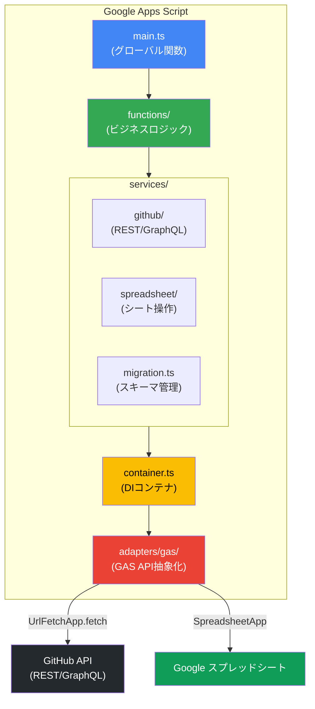
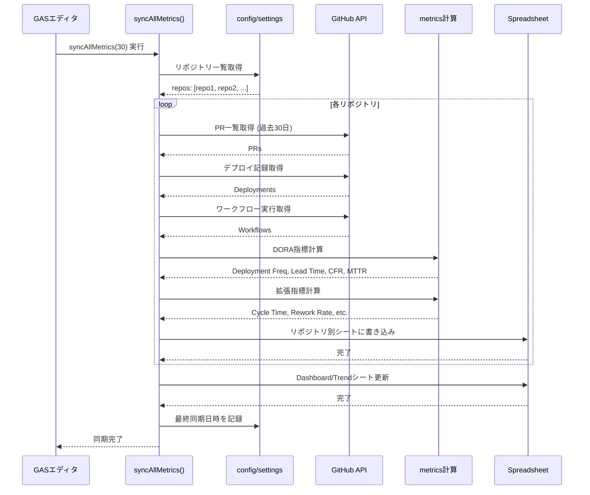

# 🏗️ DevSyncGAS アーキテクチャ

**なぜこの設計なのか？技術的な意思決定の裏側を理解する**

このドキュメントは、DevSyncGASの設計意図・構造・データフローを説明します。

> **読むべき人:** コードを読む人、拡張する人、設計判断の理由を知りたい人
>
> **読む前の疑問:** 「なぜDIコンテナ？」「なぜGraphQL優先？」「なぜスキーママイグレーション？」
>
> **読んだ後:** 「この設計なら、テストしやすく、拡張しやすい」

---

## ⚡ 3行でわかる設計思想

1. **GAS APIを抽象化** → テスト可能、環境依存を排除
2. **GraphQL優先** → API呼び出し回数を30分の1に削減
3. **リポジトリ別シート** → 問題のあるプロジェクトを即座に特定

---

## 📐 全体像

### システムアーキテクチャ（Mermaid図）



**レイヤー構成:**
1. **main.ts** - GAS公開関数（`global.*` でエクスポート）
2. **functions/** - ビジネスロジック（機能単位）
3. **services/** - 外部システム連携（GitHub、スプレッドシート）
4. **container.ts** - 依存性注入（DI）
5. **adapters/gas/** - GAS固有API実装（テスト時はモック可能）

### 詳細図（ASCII）

```
┌─────────────────────────────────────────────────────────────────────┐
│                        Google Apps Script                           │
│  ┌───────────────┐                                                  │
│  │   main.ts     │  GASエントリーポイント（グローバル関数）          │
│  └───────┬───────┘                                                  │
│          │                                                          │
│  ┌───────▼───────┐                                                  │
│  │  functions/   │  機能別ビジネスロジック                          │
│  └───────┬───────┘                                                  │
│          │                                                          │
│  ┌───────▼───────────────────────────────────────────────────────┐  │
│  │                      services/                                 │  │
│  │  ┌──────────────┐    ┌────────────────┐    ┌────────────────┐ │  │
│  │  │   github/    │    │  spreadsheet/  │    │  migration.ts  │ │  │
│  │  │  (REST/GQL)  │    │                │    │                │ │  │
│  │  └──────────────┘    └────────────────┘    └────────────────┘ │  │
│  └───────────────────────────────────────────────────────────────┘  │
│          │                                                          │
│  ┌───────▼───────┐                                                  │
│  │  container.ts │  DIコンテナ（GAS API抽象化）                     │
│  └───────┬───────┘                                                  │
│          │                                                          │
│  ┌───────▼───────┐                                                  │
│  │  adapters/gas │  GAS固有API実装（UrlFetchApp等）                 │
│  └───────────────┘                                                  │
└─────────────────────────────────────────────────────────────────────┘
          │                                      │
          ▼                                      ▼
   ┌─────────────┐                      ┌──────────────┐
   │  GitHub API │                      │ Spreadsheet  │
   │ (REST/GQL)  │                      │              │
   └─────────────┘                      └──────────────┘
```

---

## 📁 ディレクトリ構成と責務

```
src/
├── main.ts                 # GASエントリーポイント
├── container.ts            # DIコンテナ
├── interfaces/             # 抽象インターフェース
│   └── index.ts            #   HttpClient, SpreadsheetClient等
├── adapters/
│   └── gas/                # GAS固有実装
│       └── index.ts        #   UrlFetchApp, SpreadsheetApp等
├── config/
│   ├── settings.ts         # スクリプトプロパティ管理
│   └── doraThresholds.ts   # DORAパフォーマンス閾値
├── functions/              # ビジネスロジック層
│   ├── extendedMetrics.ts  #   全指標同期（DORA + 拡張指標）
│   ├── setup.ts            #   初期セットアップ
│   ├── config.ts           #   設定管理
│   ├── migration.ts        #   スキーママイグレーション
│   └── debug.ts            #   デバッグ・確認用
├── services/
│   ├── github/             # GitHub API連携
│   │   ├── api.ts          #   REST API基盤
│   │   ├── graphql/        #   GraphQL API版
│   │   ├── pullRequests.ts #   PR操作
│   │   ├── deployments.ts  #   デプロイメント
│   │   ├── issues.ts       #   Issue操作
│   │   └── cycleTime.ts    #   サイクルタイム計測
│   ├── spreadsheet/        # スプレッドシート書き出し
│   │   ├── repositorySheet.ts  #   リポジトリ別シート
│   │   ├── dashboard.ts    #   Dashboardシート
│   │   ├── cycleTime.ts    #   サイクルタイムシート
│   │   └── ...             #   その他指標シート
│   ├── migration.ts        # スキーママイグレーション
│   └── githubAuth.ts       # GitHub認証（PAT/Apps）
├── schemas/
│   └── index.ts            # スプレッドシートスキーマ定義
├── types/                  # 型定義
│   ├── github.ts           #   GitHub関連
│   ├── metrics.ts          #   指標関連
│   └── config.ts           #   設定関連
└── utils/
    └── metrics/            # 指標計算ロジック
        ├── dora.ts         #   DORA指標
        ├── extended.ts     #   拡張指標
        └── aggregate.ts    #   集計
```

---

## 🔄 データフロー

### 全指標同期（syncAllMetrics / syncAllMetricsIncremental）



**処理ステップ（テキスト版）:**

```
1. 設定読み込み
   config/settings.ts → リポジトリ一覧、認証情報

2. GitHub APIからデータ取得
   services/github/ → PR、デプロイメント、ワークフロー

3. 指標計算
   - DORA指標: utils/metrics/dora.ts → Deployment Frequency, Lead Time, CFR, MTTR
   - 拡張指標: Cycle Time, Coding Time, Rework Rate, Review Efficiency, PR Size

4. スプレッドシート書き出し
   services/spreadsheet/repositorySheet.ts → リポジトリ別シート
   services/spreadsheet/dashboard.ts → Dashboard, Trend シート

5. 同期日時の記録（syncAllMetricsIncremental のみ）
   PropertiesService → 次回の差分更新に使用
```

### サイクルタイム計測

```
1. Issue一覧取得
   services/github/issues.ts → 期間内のIssue

2. PRチェーン追跡
   services/github/cycleTime.ts → Issue→PR→マージ先PRを追跡

3. Productionマージ検出
   trackToProductionMerge() → base branchがproductionパターンにマッチ

4. 時間計算・書き出し
   utils/metrics/extended.ts → サイクルタイム計算
   services/spreadsheet/cycleTime.ts → シート書き出し
```

---

## 💡 設計原則

### 1. DIコンテナによるGAS API抽象化

**課題:** GAS APIを直接呼ぶと、テストが書けない

```typescript
// ❌ こうすると...
const response = UrlFetchApp.fetch(url);  // GAS環境でないと動かない
```

**解決策:** 抽象インターフェース経由でアクセス

```typescript
// ✅ こうすれば...
const { httpClient } = getContainer();
const response = httpClient.fetch(url);  // モック実装に差し替えられる
```

**なぜこうした？**
- テスト時にモック実装を注入できる
- GAS環境以外（ローカル開発環境）でも動作確認できる
- 将来、GAS以外のプラットフォームに移行しやすい

詳細は [ADR-0002: DIコンテナによるGAS抽象化](adr/0002-di-container-for-gas-abstraction.md) を参照。

### 2. GraphQL優先（REST APIフォールバック）

**課題:** REST APIだとレート制限に引っかかる

```
REST API: PR 100件のレビュー効率取得に 300リクエスト
    ↓
GitHub API制限: 5,000 req/hour
    ↓
大規模リポジトリで制限に到達
```

**解決策:** GraphQL APIでバッチ取得

```
GraphQL API: PR 100件のレビュー効率取得に 10リクエスト（30倍効率化）
    ↓
同じ制限内で、30倍のデータを取得可能
```

```typescript
// 設定で切り替え可能
configureApiMode('graphql');  // デフォルト（推奨）
configureApiMode('rest');     // トラブル時のフォールバック
```

**なぜこうした？**
- API呼び出し回数を最大30分の1に削減
- レート制限に到達しにくい
- REST APIもサポートすることで、GraphQLに問題があっても回避可能

詳細は [ADR-0001: GraphQL APIをデフォルトに](adr/0001-graphql-api-default.md) を参照。

### 3. プロジェクトグループによる複数スプレッドシート対応

1つのGAS環境で複数プロジェクト（それぞれ異なるスプレッドシート）を管理できる。

```typescript
// src/init.ts でプロジェクトを設定
projects: [
  {
    name: 'ProjectA',
    spreadsheet: { id: 'spreadsheet-id-A' },
    repositories: [{ owner: 'org', name: 'repo1' }],
  },
  {
    name: 'ProjectB',
    spreadsheet: { id: 'spreadsheet-id-B' },
    repositories: [{ owner: 'org', name: 'repo2' }],
  },
],
```

変更後は `bun run push` → `initConfig()` → `syncAllMetrics()` で同期。

### 4. スキーママイグレーション

スプレッドシートのヘッダー構造変更時、既存データを保持したまま移行できる。

```typescript
previewMigration();   // 変更内容を確認
migrateAllSchemas();  // 実行
```

### 5. リポジトリ別シート構造

**課題:** 全リポジトリを1シートにまとめると、見づらい

```
❌ 従来: 1シートに全データ
owner/repo-a | 2024-01-01 | 10 | daily | ...
owner/repo-a | 2024-01-02 | 12 | daily | ...
owner/repo-b | 2024-01-01 | 5  | weekly | ...
owner/repo-b | 2024-01-02 | 3  | weekly | ...
    ↓
スクロールが大変、フィルタリングが必要
```

**解決策:** リポジトリごとにシート分離

```
✅ 改善: リポジトリ別シート + Dashboard
プロジェクト (スプレッドシート)
├── 📊 Dashboard                    # 全リポ×全指標の俯瞰 + ステータス
├── 📈 Dashboard - Trend            # 週次トレンド
├── 📁 owner/repo-a                 # リポジトリ別データ
├── 📁 owner/repo-b
└── 📁 owner/repo-c
    ↓
シートタブで即座に切り替え、問題のあるリポジトリが一目瞭然
```

**なぜこうした？**
- 問題のあるリポジトリを即座に特定できる
- Dashboardで全体俯瞰、個別シートで詳細分析
- ステータス（良好/要注意/要対応）を色分け表示

```typescript
// DORA指標のみ同期（Dashboard自動生成）
syncAllMetrics(30);

// DORA + 拡張指標を全て同期（推奨、履歴データ含む）
syncAllMetrics();       // デフォルト: 過去30日
syncAllMetrics(90);     // 過去90日分
```

---

## ⚠️ 制約事項

### GAS実行時間制限

- 最大6分で強制終了
- 大量リポジトリの場合は分割実行が必要

### GitHub APIレート制限

| API | 制限 |
|-----|------|
| REST | 5,000 req/hour（PAT）、15,000 req/hour（Apps） |
| GraphQL | 5,000 points/hour |

### PRチェーン追跡深度

最大5段階まで。実運用で5段階を超えるケースは稀。

---

## 🛠 技術スタック詳細

### GAS制約への対応

| 制約 | 対応 | 理由 |
|------|------|------|
| `fetch` 不可 | `UrlFetchApp.fetch` を使用 | GAS標準API |
| モジュールシステム不可 | esbuildで単一ファイルにバンドル | GAS実行環境の制約 |
| Node.js標準ライブラリ不可 | GAS互換のユーティリティを実装 | `Buffer`, `crypto`等は利用不可 |
| ストレージ | `PropertiesService` を使用 | GAS標準の永続化機構 |

### 品質管理ツール

```bash
# 全品質チェック（一括実行）
bun run check:all

# 個別チェック
bun run check:types    # 型チェック（目標95%以上）
bun run check:circular # 循環依存チェック
bun run check:unused   # 未使用コードチェック
```

**型カバレッジ**: 95%以上を維持（`bun run check:types`で測定）

**詳細**: [CODE_QUALITY.md](CODE_QUALITY.md)

---

## 関連ドキュメント

### 設計思想
- [docs/MEASUREMENT_PHILOSOPHY.md](MEASUREMENT_PHILOSOPHY.md) - 計測思想（なぜIssue作成から計測するか）

### 指標の詳細
- [docs/CYCLE_TIME.md](CYCLE_TIME.md) - サイクルタイム計測の詳細
- [docs/CODING_TIME.md](CODING_TIME.md) - コーディング時間計測の詳細
- [docs/REWORK_RATE.md](REWORK_RATE.md) - 手戻り率計測の詳細
- [docs/REVIEW_EFFICIENCY.md](REVIEW_EFFICIENCY.md) - レビュー効率計測の詳細
- [docs/PR_SIZE.md](PR_SIZE.md) - PRサイズ計測の詳細

### 開発ガイド
- [CLAUDE.md](../CLAUDE.md) - 開発コマンド、skill
- [CODE_QUALITY.md](CODE_QUALITY.md) - コード品質管理・自動チェック
- [REFACTORING_GUIDE.md](REFACTORING_GUIDE.md) - リファクタリングの実践的ガイド
